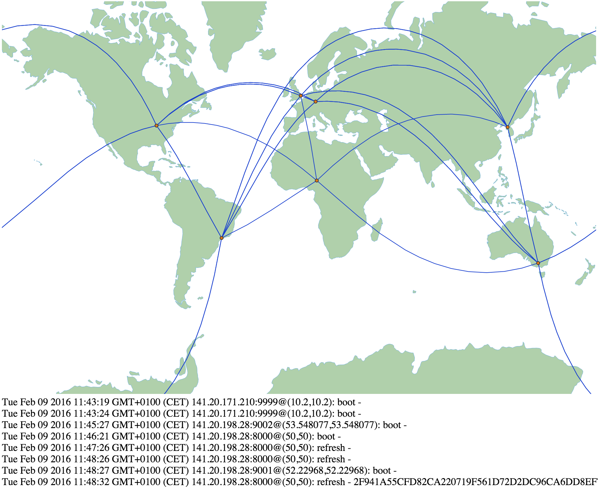

Central log-server for [p2p-local-search](https://github.com/p2p-ws1516/local-search).
This will open an UDP port on 0.0.0.0:9876 and listen to logs from clients.

## Install

1. Make sure you have nodejs installed: `$ node --version`
2. [Install MeteorJs](https://www.meteor.com/install)
3. run it with `$ meteor`

